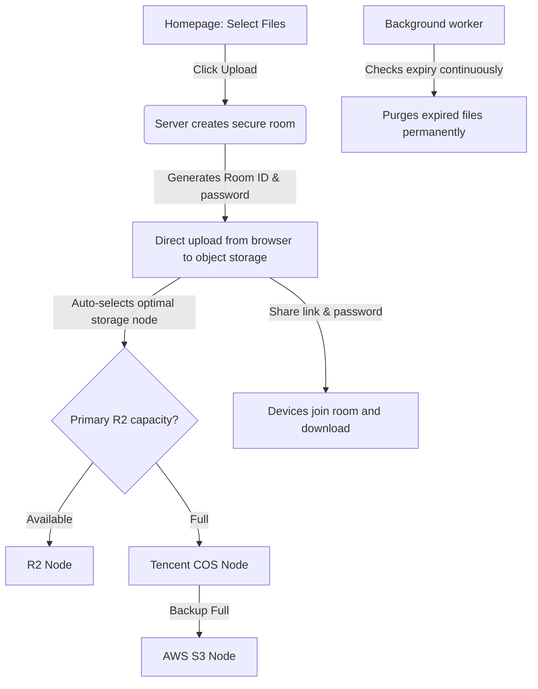

# iLoveTempDrive

### Zero-Trace Temporary File Storage & Instant Sharing

No registration. No tracking. Auto-destructs after 5 hours.

 

 

[Try It Live](https://ilovetempdrive.xyz) • [Status Page](https://ilovetempdrive.xyz/status)

##  What is iLoveTempDrive?

iLoveTempDrive is a **zero-trace temporary file storage and instant sharing platform**. Users can upload files up to 1 GB per session, share them via a unique room link, and everything gets permanently deleted after 5 hours. No sign-ups, no persistent accounts, no recovery possible.

> **The Backstory**
> It was born from a simple frustration: every time you need to print a document, you send it to yourself on WhatsApp, open it on another device, and download. Convenient, but not secure. Sensitive files like ID proofs, bank statements, and medical records end up floating around in messaging apps forever.
>
> iLoveTempDrive fixes that: upload, share, and it is gone.

 

##  Features

<table width="100%">
<tr>
<td width="50%" valign="top">

###  Core Experience
* **Zero-Trace Design** : No accounts, no tracking cookies, no persistent data
* **5-Hour Auto-Destruct** : Rooms and all files are permanently purged after 5 hours
* **1 GB Per Session** : Upload multiple files up to 1 GB total per room
* **Password-Protected Rooms** : Every room is locked with a unique password
* **Multi-Device Access** : Up to 5 devices can join a single room simultaneously

</td>
<td width="50%" valign="top">

###  Under The Hood
* **Direct Browser Uploads** : Files stream directly to object storage via presigned URLs
* **Multipart Chunking** : Large files are split into chunks and uploaded in parallel
* **Multi-Node Fallback** : Auto-overflow from Cloudflare R2 to Tencent COS to AWS S3
* **CloudFront CDN** : Downloads served via signed CloudFront URLs for fast delivery
* **Real-Time Status** : Live health monitoring dashboard at `/status`

</td>
</tr>
</table>

 

##  How It Works

1. **Create a Room** : Select files and click upload on the homepage.
2. **Room Generated** : Server creates a room with a unique ID, password, and a 5-hour TTL timer.
3. **Direct Upload** : Files stream directly from your browser to object storage using presigned URLs.
4. **Node Selection** : The server picks the best storage node based on available capacity, automatically overflowing to backup nodes if the primary is full.
5. **Share the Link** : The room URL and password are shared with others who can join and download files.
6. **Auto-Purge** : A background cleanup thread continuously checks for expired rooms and permanently deletes all associated files from storage.

 

##  Tech Stack

| Layer | Technology | Purpose |
| :--- | :--- | :--- |
| **Backend** |  Python +  Flask | Web framework and API server |
| **Server** |  Gunicorn | Production WSGI server with multi-threading |
| **Database** |  MongoDB (Atlas) | Room metadata, file records, analytics |
| **Primary Storage** |  Cloudflare R2 | S3-compatible object storage (zero egress fees) |
| **Secondary Storage** |  Tencent COS | Fallback overflow node |
| **Tertiary Storage** |  AWS S3 | Additional overflow with CloudFront CDN |
| **CDN** |  AWS CloudFront | Signed URL downloads for S3-stored files |
| **Reverse Proxy** |  Apache | TLS termination, HTTP/2, request routing |
| **Styling** |  Tailwind CSS | Utility-first CSS framework |
| **Frontend** |  Vanilla JavaScript | Direct upload client with multipart chunking |

 

##  Security Protocols

* **CSRF Protection** : All forms and API calls are protected with CSRF tokens.
* **Rate Limiting** : Per-IP rate limits on room creation, joining, and API calls.
* **Brute Force Protection** : IP lockout after repeated failed room join attempts.
* **Secure Sessions** : HttpOnly, SameSite=Lax, Secure (in production) cookies.
* **No Persistent Data** : Zero redundant backups; once purged, recovery is impossible.
* **Password Hashing** : Room passwords are hashed with Werkzeug's secure hasher.
* **Signed Downloads** : CloudFront and S3 downloads use time-limited signed URLs.

 

##  Use It Live

iLoveTempDrive is live and free to use at:

### [https://ilovetempdrive.xyz](https://ilovetempdrive.xyz)

No sign-up required. Just open the site, drag your files, and share.

 

##  Contributors

<table align="center">
<tr>
<td align="center" width="250px">
<a href="https://github.com/mainaloohun">

 
 
<strong>Asad</strong>
</a>
 
Ideator & Backend Developer
 
 
Proposed the zero-trace concept and architected the backend infrastructure.
</td>
<td align="center" width="250px">
<a href="https://github.com/ffenjil">

 
 
<strong>Jil</strong>
</a>
 
Designer & Developer
 
 
Designed the UI from the ground up and brought the visual identity to life.
</td>
</tr>
</table>

 

---

**Made with  by [Asad](https://github.com/mainaloohun) & [Jil](https://github.com/ffenjil)**

 

iLoveTempDrive &copy; 2026. All rights reserved.

